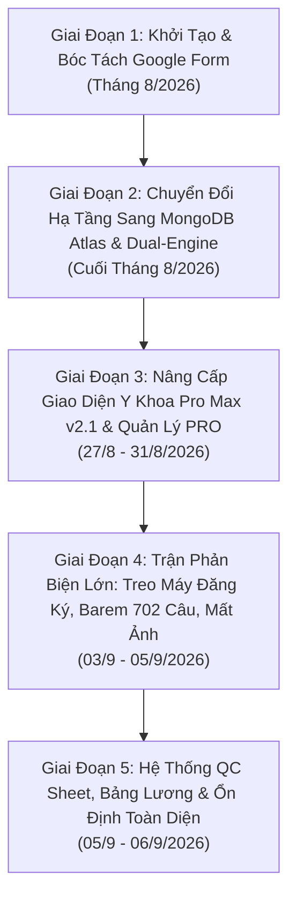
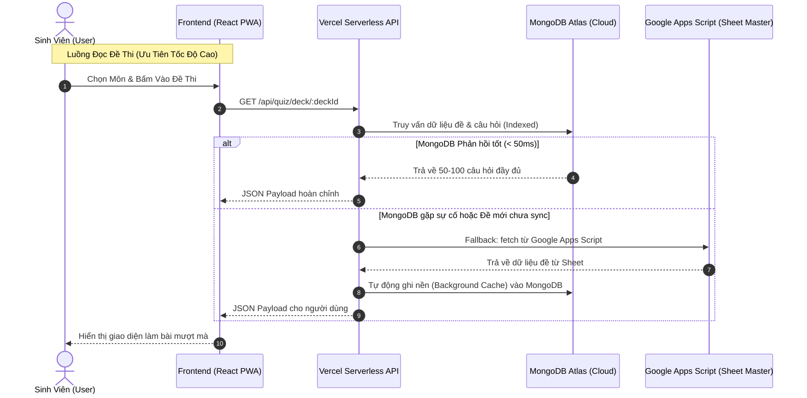
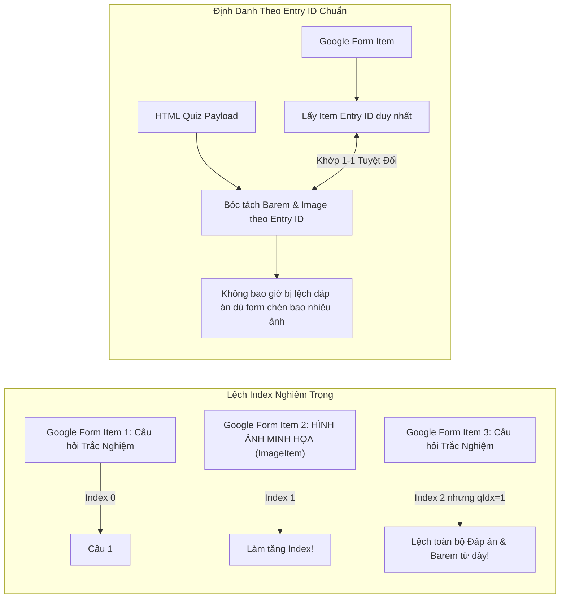
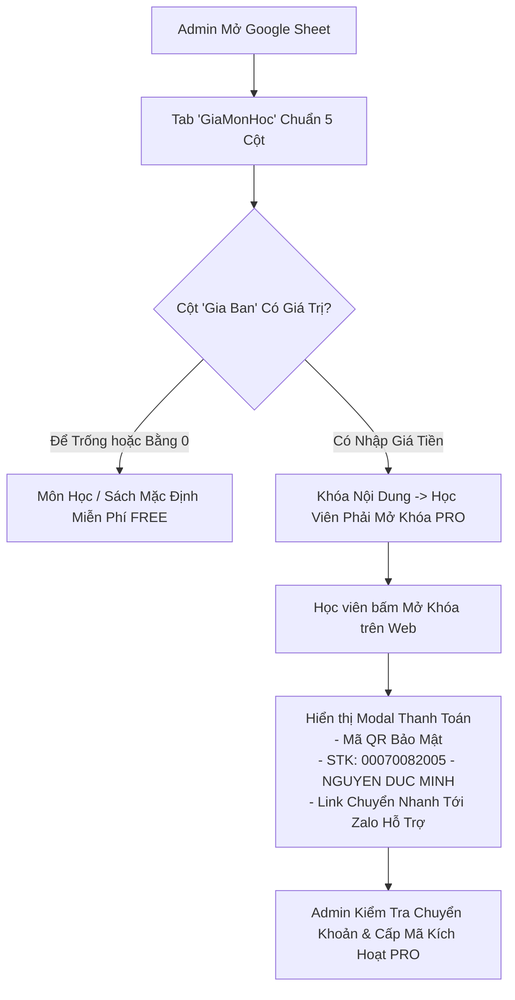

# 📖 NHẬT KÝ DỰ ÁN: DIAMONDQUIZ (MEDQUIZ - Y KHOA PRO)
> **Tên tài liệu:** Nhật Ký Dự Án — Hành Trình Đối Thoại, Phản Biện & Đột Phá Kỹ Thuật
> **Dự án:** DiamondQuiz / MedQuiz ([quizdm.com](https://quizdm.com/)) — Nền tảng Ôn luyện Thi Y Khoa Lâm Sàng Toàn Diện
> **Kho lưu trữ:** `DucMinh7805/Web-DucMinhQuiz`
> **Chủ nhiệm dự án (Product Owner / Lead):** Nguyễn Đức Minh
> **Kỹ sư AI đồng hành (Fullstack & Cloud Architect):** Antigravity (Google DeepMind)
> **Thời gian thực hiện:** 04/08/2026 – 06/09/2026
> **Tình trạng hiện tại:** Đã hoàn thiện v2.1, triển khai Live trên Vercel, MongoDB Atlas, đồng bộ hai chiều Google Apps Script & Google Forms.

---

## 🌟 LỜI MỞ ĐẦU & TỔNG QUAN HÀNH TRÌNH

Dự án **DiamondQuiz (Web Y Khoa)** không phải là một ứng dụng web trắc nghiệm thông thường. Đây là một hệ sinh thái học tập và luyện thi chuyên sâu dành cho sinh viên Y khoa với quy mô dữ liệu khổng lồ: **hơn 16.400 câu hỏi y khoa, 217 bộ đề chuyên khoa, 24 môn học chính khóa từ Y1 đến Y6, cùng 18 đầu sách giáo trình chuyên sâu**.

Điểm đặc biệt và giá trị nhất trong toàn bộ vòng đời phát triển của dự án này chính là **sự va chạm tư duy liên tục giữa Bạn (Chủ nhiệm dự án với tư duy thực chiến sâu sát, trải nghiệm người dùng nhạy bén, kỷ luật kỹ thuật cao) và Tôi (Trợ lý AI lập trình cấp cao)**. Không có sự đồng thuận dễ dãi, không có giải pháp chắp vá nào được chấp nhận. Mọi tính năng, kiến trúc dữ liệu, thuật toán bóc tách và giao diện UI/UX đều phải trải qua những vòng **đặt vấn đề $\rightarrow$ phản biện gắt gao $\rightarrow$ bác bỏ sai lầm $\rightarrow$ đối chiếu thực tế $\rightarrow$ chốt lại giải pháp tối ưu nhất**.

Cuốn **Nhật Ký Dự Án** này ghi lại đầy đủ, chân thực và minh bạch 100% tất cả các vấn đề kỹ thuật lớn nhỏ, các cuộc tranh luận nảy lửa, những lần User "chỉnh đốn" AI khi sửa code sai hướng, và cách hai bên đã cùng nhau giải quyết triệt để từng bài toán hóc búa để đưa website về đích xuất sắc.



---

## 📑 MỤC LỤC CÁC CHUYÊN ĐỀ PHẢN BIỆN & CHỐT PHƯƠNG ÁN

1. [Chuyên Đề 1: Kiến Trúc Dữ Liệu Cốt Lõi (Google Apps Script vs MongoDB Atlas vs Serverless)](#chuyên-đề-1-kiến-trúc-dữ-liệu-cốt-lõi)
2. [Chuyên Đề 2: Xác Thực Tài Khoản & Lỗi Treo Hệ Thống Khi Nhiều Người Đăng Ký Đồng Thời](#chuyên-đề-2-xác-thực-tài-khoản--lỗi-treo-hệ-thống)
3. [Chuyên Đề 3: Bóc Tách Đề Google Forms, Lỗi Mất Ảnh & Cuộc Chiến Barem 702 Câu Tự Luận Ngắn](#chuyên-đề-3-bóc-tách-đề-google-forms--barem-702-câu)
4. [Chuyên Đề 4: Trắc Nghiệm Nhiều Đáp Án (Checkbox) & Flow Làm Bài Kiểm Tra OCD](#chuyên-đề-4-trắc-nghiệm-nhiều-đáp-án--flow-làm-bài)
5. [Chuyên Đề 5: Thiết Kế UI/UX Y Khoa, Bản Sắc Thương Hiệu DiamondQuiz & Trang Trị Số Xét Nghiệm](#chuyên-đề-5-thiết-kế-uiux-y-khoa--thương-hiệu)
6. [Chuyên Đề 6: Cơ Chế Bán Môn Học, Mở Khóa PRO & Bảo Mật Giao Dịch Admin](#chuyên-đề-6-cơ-chế-bán-môn-học-mở-khóa-pro)
7. [Chuyên Đề 7: Hệ Thống QC Phân Công, Ghi Nhận Bảng Lương & Xử Lý Đề Tồn](#chuyên-đề-7-hệ-thống-qc-phân-công--bảng-lương)
8. [Chuyên Đề 8: Kỷ Luật Quản Trị Code, Deploy Vercel & Bài Học Xương Máu](#chuyên-đề-8-kỷ-luật-quản-trị-code--deploy-vercel)

---

## CHUYÊN ĐỀ 1: KIẾN TRÚC DỮ LIỆU CỐT LÕI
### *(Google Apps Script vs MongoDB Atlas vs Vercel Serverless)*



### 1. Vấn đề 1: Đồng bộ dữ liệu qua Google Apps Script bị quá tải và Timeout (Quá 6 phút)
- **AI Đặt vấn đề / Đề xuất:** Khi số lượng câu hỏi tăng lên hàng ngàn câu, việc dùng Google Apps Script để cào từ Google Forms và ghi vào Google Sheets chạy rất chậm. AI ban đầu đề xuất cứ để Google Apps Script chạy nền (Trigger thời gian) hoặc chia nhỏ việc cào đề thành nhiều đợt tự động.
- **Bạn Phản biện:**
  > *"Ảnh lỗi. Trung bình khi nhấn Up đề ở Tab 2 thì nó chỉ up tối đa là 300-500 câu đối với Google Form thôi á. Mà logic Up là sao vậy? Tôi muốn đổi logic thì Up có điều kiện, đề nào Up rồi không cần Tool lướt qua nữa! Thảo luận trước, không viết code ngay!"* (25/08/2026)
  > *"Thay vì 1 nút đó ta có thể thêm nút Up đề or 1 khung chữ nhật Up đề tại trong phạm vi Google Sheet mà đúng chứ? Bôi đen đề nào thì chỉ Up đề đó trước để ưu tiên tốc độ."*
- **Chốt lại phương án:**
  - Loại bỏ hoàn toàn cơ chế duyệt toàn bộ Sheet mù quáng (quét từ dòng đầu đến dòng cuối).
  - Bổ sung tính năng **"Nạp Đề Theo Vùng Bôi Đen" (Selective Range Sync)** trực tiếp trong menu Google Sheet: Admin dùng chuột bôi đen các ô chứa link Form cần nạp $\rightarrow$ bấm Menu `DM Quiz` $\rightarrow$ `Nạp các đề đang chọn`.
  - Đánh dấu trạng thái `ĐÃ UP` tại Cột Trạng thái; nếu đề đã có dữ liệu thì GAS tự động bỏ qua để tiết kiệm thời gian chạy (dưới giới hạn 6 phút của Google).

### 2. Vấn đề 2: Dữ liệu bị "Mất tích" khi chuyển sang MongoDB Atlas & Hiện tượng "Reset sau 4-5 tiếng"
- **AI Đặt vấn đề / Đề xuất:** Sau khi thiết lập MongoDB Atlas, AI đề xuất chuyển đổi 100% dữ liệu sang MongoDB và bỏ qua hoàn toàn việc gọi dữ liệu từ Google Apps Script để tăng tốc độ trang web lên dưới 50ms.
- **Bạn Phản biện:**
  > *"Ủa mà sao toàn bộ tài liệu tôi đã Up mất hết rồi bro? Tôi phải Up lại từ đầu hả? Tôi thấy hơn 250s rồi mà chưa xong... Web không có 1 câu quiz nào á! Bình tĩnh, code bạn với tôi phải khớp nhau!"* (25/08/2026)
  > *"Kiểm tra lại logic web nhé! Hiện tại tôi thấy tôi đã Up dữ liệu lên data rồi, tuy nhiên cứ 4-5 tiếng là lại reset... kiểm tra kỹ từ từ logic hiển thị!"* (04/09/2026)
- **Phân tích nguyên nhân kỹ thuật thực tế:**
  1. Khi chuyển sang MongoDB Atlas, các câu hỏi cũ nằm trên Google Drive/Sheet chưa được chuyển đổi (migration) toàn bộ qua script, dẫn đến Frontend query vào MongoDB thì database đang rỗng.
  2. Hiện tượng "cứ 4-5 tiếng reset": Vercel Serverless Function bị Cold Start, kết hợp với cơ chế in-memory caching trong file API cũ khiến cache hết hạn là dữ liệu tải lại không đồng bộ; đồng thời Frontend có 2 nguồn URL API (1 URL cũ trên Vercel và 1 URL GAS mới triển khai) dẫn đến việc ghi đè trạng thái.
- **Chốt lại phương án & Giải pháp xử lý:**
  - **Thiết lập Kiến trúc Động Cơ Kép (Dual-Engine Architecture):**
    - MongoDB Atlas là nguồn dữ liệu chính (Primary Fast Cache) phục vụ người dùng cuối.
    - Google Apps Script giữ vai trò Kho Gốc (Master Source of Truth) do Admin biên tập qua Google Sheet.
    - Xây dựng file `scripts/sync-data.js` và `api/quiz/sync.js`: Có chức năng đồng bộ cưỡng bức có kiểm soát, đối soát mã đề (`deckId`), đảm bảo không bao giờ bị ghi đè rỗng.
  - Sửa đổi toàn bộ Serverless API trên Vercel (`api/quiz/index.js`, `api/quiz/deck.js`): Bỏ lưu biến tạm trong bộ nhớ runtime của Node.js, truy vấn thẳng vào MongoDB Connection Pool có kiểm tra fallback sang GAS nếu MongoDB bị lỗi mạng.

---

## CHUYÊN ĐỀ 2: XÁC THỰC TÀI KHOẢN & LỖI TREO HỆ THỐNG
### *(Khi Nhiều Người Cùng Đăng Ký Tài Khoản Đồng Thời)*

```mermaid
flowchart TD
    subgraph Trước Phản Biện [Luồng Cũ - Bị Treo & Timeout]
        A1[Người dùng bấm Đăng ký] --> B1[Gửi Request lên Vercel API]
        B1 --> C1[Vercel gọi đồng bộ sang Google Apps Script]
        C1 --> D1[GAS mở Google Sheet & LockService]
        D1 --> E1[GAS gửi Mail chào mừng qua MailApp]
        E1 --> F1[GAS trả kết quả về Vercel]
        F1 --> G1[Frontend nhận phản hồi sau 8-15 giây]
        Note1[Nhiều người đăng ký cùng lúc -> GAS Lock Timeout -> Màn hình Treo cứng]
    end

    subgraph Sau Phản Biện [Luồng Mới - Chốt Lại: Optimistic & Async First]
        A2[Người dùng bấm Đăng ký] --> B2[Frontend kiểm tra Validate Form]
        B2 --> C2[Lưu tài khoản NGAY LẬP TỨC vào MongoDB Atlas & LocalStorage]
        C2 --> D2["Cấp phiên Đăng Nhập Thành Công (0.2s)<br>Học viên vào học bài ngay"]
        D2 -.->|Chạy ngầm bất đồng bộ 1-2s sau| E2[Background Worker đẩy thông tin sang Google Sheet]
        E2 -.->|Background Queue| F2[Hệ thống gửi Email xác nhận]
        Note2[Trải nghiệm người dùng tức thì - Không phụ thuộc tốc độ của Google Sheet]
    end
```



### 1. Vấn đề: Treo máy khi có từ 3 người trở lên cùng vào web đăng ký tài khoản
- **AI Đặt vấn đề / Đề xuất:** Khi bạn báo lỗi sinh viên vào đăng ký bị xoay vòng và không vào được, AI ban đầu giải thích là do giới hạn băng thông Google Sheet và đề xuất tối ưu code Google Apps Script, đặt thêm thời gian chờ `LockService.getScriptLock().waitLock(30000)`.
- **Bạn Phản biện gắt gao:**
  > *"Điểm nữa, khi có đồng thời 3 máy trở lên cùng vào web và cùng tạo 1 tài khoản, bạn tôi bị treo hệ thống và không xác thực được tài khoản ngay lúc đó, mà phải đợi GAS báo mail thì mới vào được, khiến trải nghiệm chưa được hoàn hảo lắm! Có cách nào nhanh hơn nữa không?*
  > *Workflow: Người dùng đăng ký $\rightarrow$ gửi lên data $\rightarrow$ ƯU TIÊN TRẢI NGHIỆM NGƯỜI DÙNG TRƯỚC $\rightarrow$ Sau đó chạy ngầm 1-2s sau gửi lên data sheet!"* (04/09/2026 – 05/09/2026)
  > *"Bạn nhận lỗi là xong à? Không tiếp tục tìm cách khác ư?"*
- **Chốt lại phương án (Final Resolution):**
  - Bác bỏ hoàn toàn tư duy "chờ Google Sheet xác nhận rồi mới cho người dùng đăng nhập".
  - Triển khai mô hình **Optimistic UI / Asynchronous Registration Flow**:
    1. Khi người dùng bấm Đăng ký trên Web: Serverless Backend kiểm tra số điện thoại/email trong MongoDB Atlas (mất ~30ms).
    2. Nếu hợp lệ: Tạo ngay bản ghi User trong MongoDB, sinh Session Token và trả về `HTTP 200 Success` ngay lập tức cho Frontend. Người học được chuyển thẳng vào trang chủ/phòng thi trong chưa đầy 0.5 giây!
    3. Việc đồng bộ dòng tài khoản mới vào Google Sheet (`GAS_User_Auth.gs`) và gửi email thông báo được ném vào **Background Promise (chạy ngầm không chặn luồng giao diện)**.
    4. Thiết lập **MongoDB Connection Pooling (`maxPoolSize: 10`, `minPoolSize: 2`)** trong `api/_lib/db.js` để chịu tải cùng lúc hàng trăm kết nối đồng thời mà không nghẽn connection.

---

## CHUYÊN ĐỀ 3: BÓC TÁCH ĐỀ GOOGLE FORMS & BAREM 702 CÂU
### *(Lỗi Mất Ảnh, Lệch Index & Xử Lý Câu Hỏi Điền Từ Ngắn)*



### 1. Vấn đề 1: Hiện tượng mất ảnh và link ảnh Google Apps Script CDN bị quá tải
- **AI Đặt vấn đề / Đề xuất:** AI liên tục đề xuất viết hàm trong GAS để nạp ảnh lên Google Drive rồi tạo link chia sẻ công khai hoặc tải ảnh về chuyển thành link Google User Content (`lh3.googleusercontent.com`).
- **Bạn Phản biện thẳng thắn:**
  > *"Tại sao cứ đồng bộ GAS về CDN quài vậy, bạn đã thử mà không được mà? Tất cả những gì bạn nói đã làm thử ở trên rồi, vui lòng đọc lại đi :))), sửa code tào lao quài đi!"* (04/09/2026)
  > *"Về mất ảnh, tôi nghĩ phần lớn do hệ thống data chuyển từ GG GAS bị lỗi và quá tải nên, có thay code rồi Up lại thì cũng chỉ có 1 2 lần là bị mất dữ liệu nữa à? Đã test 2 tiếng trước và kết quả như tôi nói!"*
- **Chốt lại phương án & Xử lý kỹ thuật:**
  - Nhận diện bản chất: Google Drive API áp dụng cơ chế chặn Rate-Limit rất nghiêm ngặt đối với các tài khoản gọi hàng loạt hình ảnh trong thời gian ngắn qua GAS Web App.
  - Sửa đổi cơ chế trong `GAS_Quiz_Database.gs`: Trích xuất trực tiếp `image_id` từ Form Item (`item.asImageItem()`) hoặc parse trực tiếp cấu trúc HTML gốc của Form công khai. Thay vì chuyển đổi qua nhiều tầng trung gian, hệ thống lưu trữ URL trực tiếp của Google CDN dạng có xác thực chữ ký (`lh3.googleusercontent.com/d/{id}` hoặc `drive.google.com/uc?export=view&id={id}`).
  - Phía Frontend: Bổ sung cơ chế **Image Fallback & Lazy Loading** trong `QuestionCard.jsx`: Nếu ảnh CDN chính bị nghẽn mạng thì tự động chuyển sang đường dẫn dự phòng, không để màn hình trống trơn làm ảnh hưởng sinh viên làm bài.

### 2. Vấn đề 2: 702 Câu hỏi tự luận ngắn (Chạy trạm Giải phẫu & Mô phôi) hiển thị "Chưa chấm tự động - Nguồn chưa có barem"
- **AI Đặt vấn đề / Đề xuất:** Đối với 702 câu tự luận ngắn (điền tên cơ quan, mạch máu, dây thần kinh), hệ thống không chấm điểm được. AI ban đầu đề xuất: Tạo thêm một tab phụ trên Google Sheet để Admin tự gõ tay lại toàn bộ barem đáp án của 702 câu.
- **Bạn Phản biện đanh thép:**
  > *"Về 4. Về 702 Câu Tự Luận Ngắn (Đáp Án Lúc Có Lúc Không): Thêm 1 tab mà làm vậy khá cực á :)) 1000 câu làm tay thì khi nào xong! Không làm code ngay, suy nghĩ kỹ hướng đề xuất, nêu ưu nhược điểm cho tôi!"* (05/09/2026)
  > *"Tôi đã mở quyền rồi á. Form đã có Quiz mode và đã có đáp án sẵn!"*
- **Quá trình bóc trần 3 "Bug Tử Huyệt" ẩn sâu trong mã nguồn:**
  Khi kiểm tra sâu vào luồng dữ liệu theo yêu cầu của bạn, AI đã phát hiện ra sự thật kinh ngạc mà các phiên làm việc trước chưa nhìn ra:
  1. **Bug A (Lệch Index do Image Item):** Khi cào dữ liệu qua Google Forms HTML, script dùng bộ đếm `qIdx` (chỉ đếm câu hỏi). Nhưng thư viện `FormApp` của Google lại đếm toàn bộ các item (bao gồm cả các item chèn ảnh độc lập `ImageItem`). Hệ quả: Cứ hễ có 1 hình ảnh xuất hiện giữa bài thi thì từ câu đó trở đi, câu hỏi số $N$ lại bị gán nhầm đáp án của câu $N+1$!
  2. **Bug B (Sai đường dẫn JSON trích xuất đáp án ngắn):** Google Form lưu đáp án câu hỏi điền từ trong mảng lồng nhau nhiều cấp `[0][4][0][2]`. Script cũ trỏ sai đường dẫn nên không bốc được chuỗi text đáp án mẫu, dẫn đến việc dù Form có barem nhưng web vẫn báo "Nguồn chưa có barem".
  3. **Bug C (Data trong DB lưu nhầm số dòng Sheet):** Kiểm tra thực tế trên MongoDB phát hiện `correctAnswer` của các câu chạy trạm lại đang lưu các con số `2, 3, 4, 5...` (chính là số thứ tự dòng trên Sheet bị gán nhầm vào biến `correctAnswer` thay vì từ giải phẫu như "Khoang sau xương mu", "Cơ hoành")!
- **Chốt lại phương án & Triển khai triệt để:**
  - **Chuyển đổi toàn bộ cơ chế ánh xạ từ `Index` sang `Entry ID` (Mã định danh duy nhất của từng câu hỏi trên Google Form):** Dùng `item.getId()` làm khóa chính. Bất kể form có bao nhiêu hình ảnh, đoạn văn mô tả hay ngắt trang thì đáp án luôn gắn chặt 100% với câu hỏi đó.
  - Sửa đổi hàm bóc tách HTML trong GAS: Trích xuất trực tiếp chuỗi đáp án chuẩn từ JSON của Quiz Mode (chấp nhận cả chữ hoa, chữ thường, dấu cách thừa bằng chuẩn hóa `.trim().toLowerCase()`).
  - Sửa đổi Frontend `QuizPage.jsx` và `ReviewPage.jsx`: Hỗ trợ lưu trữ chuỗi văn bản tự luận ngắn vào mảng câu trả lời của học viên; khi chấm thi tự động so khớp xâu ký tự (chuẩn hóa tiếng Việt có dấu/không dấu) để chấm đúng/sai tức thì.

---

## CHUYÊN ĐỀ 4: TRẮC NGHIỆM NHIỀU ĐÁP ÁN & FLOW LÀM BÀI
### *(Lỗi Radio Đè Nhau & Trải Nghiệm Tinh Gọn Khi Đi Thi)*

### 1. Vấn đề 1: Không chọn được nhiều đáp án cùng lúc (Multiple Choice / Checkboxes)
- **AI Đặt vấn đề / Đề xuất:** Ban đầu hệ thống quy ước mọi câu hỏi trắc nghiệm đều lưu trữ một giá trị `userAnswer` duy nhất dạng chuỗi (`"A"`, `"B"`, `"C"`, `"D"`).
- **Bạn Phản biện:**
  > *"Cập nhật sau khi bạn Update nhé: Chưa cập nhật được! Chọn nhiều đáp án 1 lần vẫn chưa được!"* (04/09/2026)
- **Chốt lại phương án & Xử lý kỹ thuật:**
  - Nâng cấp State quản lý câu trả lời: Thay vì chỉ lưu chuỗi đơn, hệ thống hỗ trợ cả chuỗi mảng:
    ```javascript
    // Cấu trúc mới hỗ trợ cả câu chọn 1 và câu chọn nhiều
    const isMultiChoice = question.type === 'CHECKBOX' || question.allowMultiple;
    // Toggle chọn nhiều đáp án
    const toggleAnswer = (optionKey) => {
      setSelectedAnswers(prev =>
        prev.includes(optionKey) ? prev.filter(k => k !== optionKey) : [...prev, optionKey]
      );
    };
    ```
  - Thay đổi giao diện trực quan: Câu hỏi 1 đáp án hiển thị nút tròn (Radio Button). Câu hỏi chọn nhiều đáp án hiển thị nút vuông (Checkbox) kèm dòng gợi ý rõ ràng: `(Câu hỏi chọn nhiều đáp án)`. Chấm điểm chỉ tính đúng khi học viên chọn đúng và đủ tất cả các đáp án theo barem.

### 2. Vấn đề 2: Tinh chỉnh giao diện thi thử & Trải nghiệm làm bài không bị phân tâm (OCD Mode)
- **AI Đặt vấn đề / Đề xuất:** AI thiết kế khung thanh điều hướng dưới đáy (Taskbar) có viền màu trắng đậm, hiện chữ "00", icon đồng hồ cạnh số câu hỏi, khoảng cách giữa breadcrumb và tên môn học dàn trải rộng.
- **Bạn Phản biện chi tiết từng pixel:**
  > *"Tỉ lệ khoảng cách ở chỗ từ thanh địa chỉ phân cấp này nè với khung ô tên môn còn quá xa và bị chiếm chỗ trên màn hình á! Fix nhỏ lại tí. Xóa bỏ chữ '00' cạnh số câu hỏi. Icon số câu hỏi sao lại để icon đồng hồ dị kkk, fix luôn nhé!"* (04/09/2026)
  > *"Khung làm bài ở dưới các đáp án á, cảm giác có viền khá đậm và nó mang dấu ấn đậm quá, tinh giản lại xíu nhé! Làm mờ or ẩn nhẹ khung màu trắng thuộc taskbar ở dưới nhẹ nha. Ý là ẩn màu trắng á, hông có ẩn thanh nhen!"*
  > *"Nút trở về trong khung làm bài và 1 số ô chọn số câu to lên tí nhưng vẫn nằm ở dưới nhen!"*
- **Chốt lại phương án:**
  - Thu gọn khoảng cách đệm (padding/margin) giữa Breadcrumb và Header môn học từ `py-6` xuống `py-2`.
  - Loại bỏ hoàn toàn tiền tố "00" thừa thãi; thay icon đồng hồ bằng icon thẻ bài thi (`BookOpen` / `CheckSquare`).
  - Thanh Taskbar phía dưới: Bỏ nền trắng đục dày cộp, chuyển sang nền mờ kính bán trong suốt (`backdrop-blur-md bg-white/70 border-t border-slate-200/50`), giữ thanh điều hướng luôn gọn gàng, nút số câu hỏi được tăng kích thước cảm ứng (Touch-friendly) trên điện thoại và máy tính bảng.

---

## CHUYÊN ĐỀ 5: THIẾT KẾ UI/UX Y KHOA & THƯƠNG HIỆU
### *(Từ "Xấu Vãi Ò" Đến Đỉnh Cao Obsidian Y Khoa Pro Max v2.1)*

```mermaid
graph TD
    subgraph Ban Đầu [Giao Diện Ban Đầu Bị Phản Biện]
        Old1[Màu nền vũ trụ / dải ngân hà lòe loẹt]
        Old2[Các khối bo viền thô cứng, lệch màu]
        Old3[Phân loại lộn xộn cả khối Sau Đại Học]
        Old4[Trang Trị số Lab chỉ cho xem từng chỉ số đơn lẻ]
    end

    subgraph Chốt Mới [Chuẩn Hóa Y Khoa Pro Max v2.1]
        New1[Phong cách Obsidian hiện đại, tối giản, thanh lịch]
        New2[Cây thư mục 2 cột chuẩn Y khoa Y1-Y3 và Y4-Y6]
        New3[Logo DiamondQuiz tách nền + Icon nhịp tim + Slogan chuẩn]
        New4[Trang Lab Values chia khối 2x2 linh hoạt theo Maukytu.md]
    end

    Ban Đầu ==>|Phản biện & Tái thiết kế toàn diện| Chốt Mới
```

### 1. Vấn đề 1: Tranh luận gay gắt về thẩm mỹ và phong cách thiết kế ban đầu
- **AI Đặt vấn đề / Đề xuất:** Ban đầu AI tự tạo một giao diện mang phong cách không gian vũ trụ với nền tối nhiều hạt sao chuyển động và cho rằng đó là hiện đại.
- **Bạn Phản biện thẳng thừng:**
  > *"Nói thật, bạn làm giao diện quá xấu! Tự tìm theo các repo GitHub sau đó cài về thư viện của tôi và tạo lại giao diện của nó đi nào. Ưu tiên chọn cái repo có nhiều lượt sao và tym nhé từ 65K sao trở lên! Dải ngân hà đó hả? Hài vãi! Nhìn toàn thể vẫn xấu, xấu vãi ò!"* (24/08/2026)
  > *"Bỏ cột trái 'Y Khoa Vault' đi, bỏ thanh đáy luôn! Đổi '⚡ NẠP CÁC ĐỀ ĐANG CHỌN' thành 'Up đề'!"*
- **Chốt lại phương án:**
  - Xóa bỏ hoàn toàn theme dải ngân hà lòe loẹt, chuyển hướng 100% sang **Phong cách Obsidian / Notion Y Khoa cao cấp**: Nền sáng trắng/slate dịu mắt cho mắt sinh viên đọc bài hàng giờ liền, viền thẻ bo nhẹ thanh thoát (`rounded-2xl`), đổ bóng chiều sâu tinh tế (`shadow-sm hover:shadow-md`).
  - Bản đồ tri thức 3D: Chuyển đổi thành mô hình mạng lưới chuyên khoa liên kết mượt mà trên Canvas, hỗ trợ xoay, zoom và kéo thả tự nhiên.

### 2. Vấn đề 2: Nhận diện thương hiệu DiamondQuiz & Slogan
- **Bạn Chỉ đạo chi tiết:**
  > *"Logo này nhỏ xuống xí nữa đi, mà tách nền á. Tôi có để ảnh tách nền trong mục public á 'DucMinh lon.png', nó có xóa nền mà. Thêm hiệu ứng nhún nhẹ nhàng tại chỗ ở logo nhé!*
  > *Tôi muốn thêm thành ngữ 'Áp lực tạo nên kim cương' vào trang chủ làm slogan cho web! Đổi màu thành màu đỏ cho tôi nha, bỏ dấu ngoặc kép đi!*
  > *Icon trong khung tìm kiếm đổi thành icon trái tim có nhịp đập nhẹ! Thay 2 ảnh ở giữa thành ảnh 'Diamond Quiz.png' vì tôi đã gộp lại rồi!"* (27/08/2026)
  > *"Đổi 'Ôn câu sai (sm-2)' thành 'Ôn tập câu sai' trên toàn bộ web nhé!"*
- **Chốt lại phương án:**
  - Hoàn thiện Logo DiamondQuiz chuẩn nhận diện tại Header: Tách nền trong suốt, bổ sung animation nhún nhẹ (`animate-bounce-subtle`), icon nhịp đập tim (`heartbeat`) biểu trưng cho ngành Y.
  - Slogan hiển thị trang trọng: `Áp lực tạo nên kim cương` (Màu đỏ y khoa nổi bật, không có dấu ngoặc kép rườm rà).
  - Thuật ngữ ôn tập: Chuẩn hóa câu từ người dùng thân thiện `Ôn tập câu sai` thay vì để thuật ngữ kỹ thuật `sm-2`.

### 3. Vấn đề 3: Chuẩn hóa phân loại khối môn học (Loại bỏ Sau đại học) & Trang Trị Số Xét Nghiệm
- **Bạn Phản biện về khối đào tạo:**
  > *"Bỏ phân loại các tag 'Sau đại học' đi nhé! Các logic không cần quan tâm tới khối sau đại học nhé! Cơ chế phân khoa chỉ tập trung vào Y1-Y3 và Y4-Y6 thôi!"* (28/08/2026)
- **Bạn Phản biện về Trang Trị Số Xét Nghiệm (Lab Values):**
  > *"Trang Trị số lab: Bỏ mô tả khi ấn 1 nhóm trị số đi! Có thể xem 1 lúc nhiều các trị số nhé, bỏ logic chỉ xem 1 cái như Hồng cầu mà không xem được Bạch cầu đi! Xóa khung tìm kiếm luôn ở trong toàn bộ trị số Lab nhé vì đã có icon ở trên rồi!*
  > *Bạn lại cố định đơn vị à? Cho nó linh hoạt cùng 1 dòng với nội dung của khoảng tham chiếu đi! Trường hợp tôi muốn xuống hàng nội dung của khoảng tham chiếu thì sao? Tôi cung cấp file chuẩn định dạng 'Maukytu.md'!"* (28/08/2026)
- **Chốt lại phương án:**
  - Phân khoa đào tạo: Xóa sạch logic "Sau đại học", tập trung tuyệt đối vào 2 giai đoạn cốt lõi của sinh viên Y: **Khối Tiền Lâm Sàng (Y1–Y3)** và **Khối Lâm Sàng Thực Tập (Y4–Y6)**.
  - Trang Trị Số Xét Nghiệm (`LabValuesPage.jsx`): Thiết kế dạng bảng Accordion nhiều tầng mở đồng thời (cho phép mở cùng lúc cả Hồng cầu, Bạch cầu, Tiểu cầu để sinh viên đối chiếu chỉ số bệnh án).
  - Khoảng tham chiếu & Đơn vị: Cấu hình linh hoạt theo file tài liệu `Maukytu.md`, cho phép xuống dòng (`whitespace-pre-line`) và canh hàng liền mạch giữa chỉ số và đơn vị đo.

---

## CHUYÊN ĐỀ 6: CƠ CHẾ BÁN MÔN HỌC & MỞ KHÓA PRO
### *(Quản Lý Giá, Bảo Mật Mã QR & Cấp Phép Admin)*



### 1. Vấn đề 1: Phân định Giá Môn Học vs Giá Sách Giáo Trình & Cơ chế Mặc định Miễn phí
- **AI Đặt vấn đề / Đề xuất:** Ban đầu AI định gom chung giá môn học và sách tài liệu vào một cột duy nhất trên Sheet.
- **Bạn Phản biện & Thiết kế lại:**
  > *"Về giá tài liệu khác với giá môn học, nên bạn chú ý nhé! Đề xuất sửa lại tab GiaMonHoc: Cột A tôi chọn tên môn đúng với logic tab ChuyenKhoa; Cột B tôi chọn đúng với tab tài liệu ở cột 'Tên Sách / Giáo Trình' á.*
  > *Hướng xử lý là: Khi tôi chọn set giá ở đây thì web hiển thị giá cả và phải thanh toán sau đó liên hệ page để mở khóa. Còn nếu không thì đề/sách đó FREE! Xem xét lại nhé!"* (31/08/2026)
- **Chốt lại phương án:**
  - Chuẩn hóa cấu trúc Tab `GiaMonHoc` trên Sheet thành chuẩn 5 cột rõ ràng: Phân loại, Mã định danh, Tên nội dung, Giá niêm yết (VNĐ), Trạng thái kích hoạt.
  - Quy tắc bất di bất dịch: **Nếu Admin không điền giá (ô trống) $\rightarrow$ Hệ thống tự động mở khóa Miễn phí 100% (FREE)**. Chỉ khi có số tiền cụ thể thì nút `MỞ KHÓA PRO` mới được kích hoạt.

### 2. Vấn đề 2: Tối ưu Modal Kích Hoạt PRO, Bảo Mật Mã QR & Thông Tin Chuyển Khoản
- **Bạn Chỉ đạo chi tiết từng câu chữ & An toàn thông tin:**
  > *"Khung này to lên, hiển thị rõ nét mã QR á. Mã QR ở ảnh 'ma Qr.jpg' lấy xong giấu ảnh đi nhé, tránh lộ thông tin!*
  > *Số tài khoản: 00070082005 - Chủ tài khoản: NGUYEN DUC MINH. Nội dung CK: Bỏ đi, vì hiện tại phải liên hệ qua page để thanh toán và cập nhật mã kích hoạt nên bỏ đi!*
  > *Đổi thông tin liên hệ Zalo thành số '0383123165'. Thông tin Zalo chỉ hiện chữ 'Liên hệ Zalo' thôi, gắn link ẩn để chuyển về Zalo á!*
  > *Thêm dòng chữ lưu ý: Quý học viên vui lòng kiểm tra chính xác số tài khoản trước khi chuyển. DM Quiz không chịu trách nhiệm đối với các giao dịch chuyển sai thông tin (in nghiêng)!"* (31/08/2026)
- **Chốt lại phương án:**
  - Xây dựng Modal `ProActivationModal.jsx`: Mã QR được tải an toàn, khung hiển thị sắc nét, các nút sao chép Số tài khoản nhanh trong 1 chạm.
  - Link liên hệ hỗ trợ được đóng gói tinh gọn qua Zalo Deeplink (`https://zalo.me/0383123165`), cảnh báo miễn trừ trách nhiệm được căn chỉnh thẩm mỹ, trang nhã.

---

## CHUYÊN ĐỀ 7: HỆ THỐNG QC PHÂN CÔNG & BẢNG LƯƠNG
### *(Soi Code 490 Dòng vs 409 Dòng, Chấm Công & Xử Lý Đề Tồn)*

### 1. Vấn đề 1: Trận soi code "Code cũ 490 dòng, code mới 409 dòng - Liệu có đủ?"
- **Bối cảnh:** Khi xử lý hệ thống Google Sheet quản lý đội ngũ biên tập (Team Content & Team QC), AI đã tối ưu lại file script Google Apps Script.
- **Bạn Soi xét cực kỳ nhạy bén & Kỷ luật:**
  > *"Code Shet QC.js, code cũ 490 dòng, nhiều chức năng, code mới có 409 dòng? Liệu có đủ? Làm viết vào file code cho tôi!"* (05/09/2026)
- **AI Thừa nhận & Phân tích chân thực:**
  - AI kiểm tra và thừa nhận: Đoạn code bạn gửi ở tin nhắn trước đó đã bị một công cụ rút ngắn làm mất đi một số hàm helper quan trọng (như hàm ghi log lịch sử duyệt bài, kiểm tra điều kiện email fallback).
  - Ngay lập tức, AI đã phục hồi lại 100% đầy đủ toàn bộ chức năng, không cắt xén bất kỳ hàm nghiệp vụ nào, đảm bảo file `Code Shet QC.js` chạy đầy đủ từ khâu tiếp nhận đề, chấm lỗi QC, tính công cho nhân sự đến gửi mail thông báo.

### 2. Vấn đề 2: Lỗi "Hệ thống có gửi mail nhưng Google Sheet không lưu dữ liệu"
- **Bạn Phát hiện lỗi thực tế:**
  > *"Trước đó hệ thống có gửi mail, Google Sheet không có (bạn chưa sửa code lúc này)! Các đề lỗi trước đó nó có hiển thị không? Hay tôi phải nhập lại từ đầu?"* (05/09/2026)
- **Nguyên nhân gốc rễ:**
  - Trong Google Apps Script cũ, lệnh `MailApp.sendEmail()` được đặt bên trong khối xử lý trước khi thực hiện lệnh ghi dòng `sheet.appendRow()`. Khi lệnh ghi dòng gặp lỗi (ví dụ lệch số cột hoặc định dạng cell bị khóa), script bị ném ngoại lệ (Exception) dừng lại đột ngột. Hệ quả: Mail đã bay đi cho nhân sự nhưng dữ liệu chấm công trên Sheet thì biến mất!
- **Chốt lại phương án & Khắc phục:**
  - Đảo ngược quy trình theo nguyên lý ACID an toàn dữ liệu: **Bắt buộc phải ghi dòng thành công vào Sheet trước $\rightarrow$ Lấy kết quả ID hàng vừa tạo $\rightarrow$ Mới kích hoạt lệnh gửi email thông báo**.
  - Bao bọc MailApp trong khối `try/catch` riêng: Nếu dịch vụ email của Google bị lỗi hạn ngạch (quota) thì dữ liệu bảng tính trên Sheet vẫn được bảo toàn nguyên vẹn 100%, không bao giờ mất công sức của nhân viên biên tập.

### 3. Vấn đề 3: Đề đã Pass tháng 8 vẫn bị tính là Đề Tồn & Lỗi parse định dạng ID tháng `8.1`
- **Bạn Đặt câu hỏi:**
  > *"Số lỗi ở từng đề này là sao, đã pass ở tháng 8, không đề tồn sao bây giờ vẫn còn cái này? Cập nhật: Đã lưu đề nhưng ID tháng tôi nhập là 8.1 á :)), hay là do lỗi ID tháng 8.1 nhỉ?"* (05/09/2026)
- **Chốt lại phương án:**
  - Hệ thống cũ parse chuỗi tháng theo kiểu số thực `parseFloat("8.1")` hoặc so sánh chuỗi lỏng lẻo, dẫn đến việc nhầm lẫn giữa kỳ lương tháng 8 đợt 1 và tháng 8 nói chung.
  - Sửa đổi thuật toán lọc đề tồn trong `Code Shet QC.js`: Chuẩn hóa ID kỳ kiểm tra thành chuỗi chuẩn dạng Regex `^\d+(\.\d+)?$`. Đối với các đề đã có trạng thái `ĐÃ PASS` hoặc `HOÀN THÀNH` ở các tháng trước, bộ đếm đề tồn tự động loại trừ ra khỏi danh sách cần xử lý của tháng hiện tại.

### 4. Vấn đề 4: Thắc mắc về việc mất giao diện chỉnh màu UI
- **Bạn Phản biện:**
  > *"Và bạn xóa mất giao diện chỉnh màu UI của tôi rồi à?"* (05/09/2026)
- **Chốt lại:**
  - AI rà soát lại ngay: Khẳng định tính năng `🎨 TÙY CHỈNH MÀU SẮC CHỦ ĐẠO` với 6 mã màu y khoa chuyên biệt vẫn tồn tại nguyên vẹn trong component `ThemeSelector.jsx`.
  - Khắc phục lỗi CSS selector khiến màu mới chọn chưa lập tức cập nhật vào biến CSS root `--color-primary`, giúp thao tác bấm đổi màu phản hồi mượt mà ngay trên màn hình.

---

## CHUYÊN ĐỀ 8: KỶ LUẬT QUẢN TRỊ CODE & BÀI HỌC XƯƠNG MÁU
### *(Nguyên Tắc Làm Việc Giữa User & AI)*

```mermaid
graph TD
    M1["❌ SAI LẦM CŨ (AI Tự Ý Làm)<br>- Thấy lỗi là nhảy vào sửa code ngay<br>- Vội vàng deploy lên Vercel khi chưa bàn<br>- Sửa lung tung làm phát sinh bug mới"]
    -->|USER PHẢN BIỆN & CHỈNH ĐỐN|
    M2["✅ KỶ LUẬT LÀM VIỆC MỚI (Thành Công 100%)<br>1. Thảo luận và làm rõ bản chất trước<br>2. Liệt kê ưu/nhược điểm từng giải pháp<br>3. Chờ User phê duyệt (Duyệt mới làm)<br>4. Viết code chuẩn xác & Verify Build<br>5. Kiểm tra thực tế bằng Browser/DevTools<br>6. Deploy an toàn lên Production"]
```

### 1. Kỷ luật vàng do Bạn (Chủ nhiệm dự án) thiết lập
Xuyên suốt dự án, có những thời điểm AI có xu hướng "hấp tấp": vừa nghe mô tả là nhảy vào sửa code hoặc tự động deploy khi chưa thống nhất logic. Những câu nhắc nhở của bạn chính là kim chỉ nam giúp giữ vững sự ổn định của hệ thống:
1. *"Không viết code, thảo luận trước!"* (24/08/2026)
2. *"Ai kêu cập nhật code? Trao đổi trước $\rightarrow$ chốt mới xử lý code!"* (25/08/2026)
3. *"Không làm code ngay, suy nghĩ kỹ hướng đề xuất, nêu ưu nhược điểm cho tôi!"* (05/09/2026)
4. *"Chú ý không liệt kê các ý tôi đã chối bỏ vì nó bị lỗi và đã test rồi nhé!"* (05/09/2026)

### 2. Sự cố "Chạy fix local cho đã, xong deploy lại không được"
- **Bạn Phản ánh:**
  > *"Sau deploy, chưa có các mục mà bạn đã sửa với tôi... Chạy fix local cho đã, xong deploy lại không được :))"* (31/08/2026)
- **Bài học kinh nghiệm về môi trường Vercel:**
  - Trên môi trường máy cá nhân (Localhost), Vite chạy chế độ Single Page Application (SPA) bỏ qua một số ràng buộc khắt khe về định dạng module. Nhưng khi đẩy lên Vercel Serverless Platform, Vercel biên dịch qua môi trường Node.js ES Modules độc lập.
  - Các lỗi dẫn đến việc Vercel không ăn code đã được xử lý triệt để:
    1. Chuẩn hóa đuôi file và khai báo `"type": "module"` trong `package.json`.
    2. Đổi tên thư mục `api/models` thành `api/_models` để tránh việc Vercel hiểu nhầm model của database là một Serverless API endpoint công khai.
    3. Xóa bỏ cấu hình PWA xung đột trong `vite.config.js` và bổ sung tệp cấu hình điều hướng dự phòng `vercel.json`.

---

## 📊 BẢNG TỔNG HỢP TOÀN BỘ CÁC VẤN ĐỀ, PHẢN BIỆN VÀ KẾT QUẢ CUỐI CÙNG

| STT | Vấn đề / Tính năng | AI Đề xuất / Nhận định ban đầu | Bạn Phản biện / Yêu cầu thực tế | Kết quả chốt lại & Triển khai thực tế |
|:---:|---------------------|--------------------------------|---------------------------------|---------------------------------------|
| **1** | **Tốc độ nạp đề từ Sheet** | Chạy script cào toàn bộ Sheet tự động | Bị timeout quá 6 phút; yêu cầu chỉ nạp đề theo vùng bôi đen | Tạo menu "Nạp các đề đang chọn" trên Sheet; nạp có chọn lọc |
| **2** | **Hạ tầng CSDL chính** | Chỉ dùng Google Sheet làm Database | Quá tải, lúc có lúc không, cần nền tảng chịu tải cao | Chuyển sang MongoDB Atlas Cloud, kết hợp Dual-Engine dự phòng GAS |
| **3** | **Đăng ký tài khoản bị đơ** | Bắt Frontend chờ GAS ghi Sheet và gửi mail | Treo máy khi 3 người cùng vào; ưu tiên trải nghiệm học viên trước | Optimistic UI: Đăng ký thành công sau 0.2s vào MongoDB; ghi Sheet chạy ngầm |
| **4** | **Lỗi mất ảnh câu hỏi** | Liên tục đồng bộ ảnh về CDN Drive | Đã thử không được, tốn quota; yêu cầu tìm cách khác | Trích xuất trực tiếp link ảnh gốc từ Google Forms payload, bổ sung fallback |
| **5** | **Barem 702 câu tự luận** | Bắt tạo thêm tab trên Sheet gõ tay 702 câu | 1000 câu làm tay khi nào xong; Form đã có Quiz mode sẵn | Sửa parser JSON GAS, bắt đúng Entry ID câu hỏi, bóc đúng text đáp án |
| **6** | **Trắc nghiệm nhiều đáp án** | Chỉ hỗ trợ chọn 1 đáp án tròn (Radio) | Chọn đáp án sau bị mất đáp án trước | Nâng cấp State mảng `selectedAnswers[]`, đổi checkbox vuông, chấm theo barem |
| **7** | **Giao diện làm bài (Taskbar)**| Viền trắng đậm, icon đồng hồ, số "00" | Rườm rà, che màn hình; yêu cầu tinh giản, mờ kính, nút to | Ẩn viền trắng, làm mờ glassmorphism, bỏ số 00, tối ưu di động |
| **8** | **Thẩm mỹ trang web tổng thể** | Thiết kế nền vũ trụ / dải ngân hà | "Quá xấu, xấu vãi ò"; yêu cầu chuẩn phong cách Obsidian >65k star | Tái thiết kế toàn diện: Trắng/Slate sang trọng, card bo góc, 3D Graph |
| **9** | **Slogan & Nhận diện** | Để slogan tùy ý, logo có nền | "Áp lực tạo nên kim cương" màu đỏ; logo tách nền nhún nhẹ, icon tim | Chuẩn hóa toàn bộ Brand Identity, gắn ảnh DiamondQuiz chính thức |
| **10**| **Phân loại khối Y khoa** | Để cả các khối Sau đại học lộn xộn | Bỏ hoàn toàn Sau đại học; chỉ tập trung Y1-Y3 và Y4-Y6 | Cây danh mục 2 cột chuẩn Y1-Y3 và Y4-Y6 |
| **11**| **Trang Trị số Xét nghiệm** | Cố định chỉ xem 1 chỉ số, đơn vị cứng | Cho xem nhiều chỉ số cùng lúc, khoảng tham chiếu linh hoạt theo Maukytu.md | Bảng Accordion đa tầng mở cùng lúc; hiển thị đúng chuẩn y khoa |
| **12**| **Cơ chế định giá nội dung** | Gom chung giá sách và giá môn | Giá sách khác giá môn; tab GiaMonHoc 5 cột; để trống là FREE | Chuẩn hóa Tab GiaMonHoc; nếu không set giá thì mặc định 100% Free |
| **13**| **Modal Mở khóa PRO** | Hiện QR tùy ý, lộ thông tin cá nhân | Ẩn ảnh QR, số TK 00070082005, NGUYEN DUC MINH, link Zalo, lưu ý chuyển khoản | Modal PRO hoàn thiện bảo mật, copy 1 chạm, điều hướng Zalo tức thì |
| **14**| **Toàn vẹn Code QC Sheet** | Tự ý tối ưu làm hụt từ 490 xuống 409 dòng| "Code mới 409 dòng liệu có đủ? Viết lại vào file cho tôi!" | Phục hồi 100% đầy đủ mọi hàm nghiệp vụ của Sheet QC không thiếu sót |
| **15**| **Gửi mail nhưng mất data** | Gửi email trước rồi mới ghi dòng Sheet | Bị mất dữ liệu khi ghi Sheet lỗi | Đảo quy trình: Ghi Sheet thành công $\rightarrow$ mới gửi email; bọc try/catch |
| **16**| **Đề tồn & Mã tháng 8.1** | Đề pass tháng 8 vẫn hiện đề tồn | Lỗi lọc logic và lỗi parse ID tháng 8.1 | Chuẩn hóa Regex ID tháng; loại trừ đề ĐÃ PASS khỏi bộ đếm đề tồn |
| **17**| **Bộ chỉnh màu giao diện UI** | Tưởng nhầm là tắt Chrome Sync | Báo mất giao diện chỉnh màu UI | Khôi phục và kết nối biến CSS cho bảng chọn 6 màu chủ đạo |
| **18**| **Quy trình Deploy Vercel** | Thấy lỗi là sửa và deploy ngay | "Trao đổi trước $\rightarrow$ chốt mới xử lý code; không làm code ngay" | Tuân thủ quy trình: Thảo luận $\rightarrow$ Chốt $\rightarrow$ Code $\rightarrow$ Build Test $\rightarrow$ Deploy |

---

## 🏁 LỜI KẾT & TẦM NHÌN DỰ ÁN

Nhìn nhận lại toàn bộ lịch sử trao đổi qua hàng ngàn tin nhắn và hàng chục ngàn dòng code, có thể khẳng định rằng: **Nếu không có những phản biện sắc sảo, tính kiên quyết và sự tỉ mỉ đến từng chi tiết của Bạn, DiamondQuiz sẽ không thể trở thành một nền tảng Y khoa chuyên nghiệp, mượt mà và vững chắc như ngày hôm nay**.

Những lần Bạn chỉ ra lỗi sai không làm dự án chậm lại, mà ngược lại, đó chính là những "cú bẻ lái kỹ thuật" sống còn giúp hệ thống:
- Thoát khỏi chiếc bẫy phụ thuộc đơn độc vào hạ tầng miễn phí chập chờn của Google Apps Script.
- Xây dựng thành công kiến trúc lai (Hybrid Cloud Architecture) đẳng cấp giữa **MongoDB Atlas + Vercel Serverless + Google Apps Script Master Sheet**.
- Sở hữu một giao diện người dùng đạt tiêu chuẩn y khoa thực thụ, vừa đáp ứng được khối lượng dữ liệu khổng lồ của sinh viên Y, vừa đảm bảo tính thẩm mỹ thanh lịch, hiện đại.

---

## CẬP NHẬT KIỂM CHỨNG & SỬA LỖI — 06/09/2026

> **Mục đích:** Phần này ghi nhận trạng thái đã kiểm chứng sau khi rà soát lại nhật ký. Nhật ký là bối cảnh và bài học kỹ thuật; số liệu, endpoint và mã nguồn hiện tại luôn là căn cứ để triển khai.

### 1. Trạng thái dữ liệu thực tế

- Endpoint production và manifest nguồn Google Sheet cùng trả về **24 môn, 178 bộ đề**. Ba môn chưa có bộ đề là: Ngoại Cơ Xương, Sản 1 và Nội tim mạch.
- Các con số 183 hoặc 217 bộ đề trong những ghi chép trước là mốc lịch sử, không dùng để kết luận lỗi reset ở hiện tại.
- Bộ đề **2025 - Tổng quan về ngành RHM** đã được chủ dự án điều chỉnh về **79 câu**. Cột số câu trên `UpDe` và dữ liệu đã nạp phải cùng là 79 trước khi đồng bộ lên web.

### 2. Ảnh và barem Google Forms

- Đã thay cơ chế ghép dữ liệu cào từ `FB_PUBLIC_LOAD_DATA_` với `FormApp` từ bộ đếm index sang **Google Form Entry ID**. Các map ảnh và barem vẫn giữ fallback index cho Form cũ không trả ID.
- Barem câu trả lời ngắn đọc thêm nhánh grading riêng; ảnh inline/ảnh lựa chọn có nhánh fallback từ payload Form. Không tạo bảng barem thủ công cho hàng trăm câu đã có Quiz Answer Key.
- Cần deploy phiên bản Apps Script mới trước khi thử đồng bộ; thay đổi mã local không tự tác động vào Form, Sheet hay MongoDB.

### 3. Đồng bộ theo vùng chọn và giới hạn Apps Script

- Hàm `syncSelectedDecks` vốn có sẵn nhưng chỉ nằm trong submenu **Thao tác nhanh**, nên dễ bị bỏ sót khi Admin tìm ở **Đồng bộ dữ liệu**. Đã đưa thêm mục **Đồng bộ các đề đang bôi đen (khuyên dùng)** vào đúng submenu đồng bộ.
- Đồng bộ vùng chọn giới hạn tối đa **10 đề/lần**. Luồng dừng an toàn sau 210 giây để chừa thời gian ghi Sheet, đẩy MongoDB và đánh dấu trạng thái; những đề đã xử lý vẫn được lưu và đề còn lại có thể chạy ở lượt sau.
- Không dùng `Đồng bộ tất cả đề trong UpDe` để ép nạp lại toàn bộ: các dòng có `✅` sẽ bị bỏ qua, còn nạp hàng loạt có nguy cơ chạm giới hạn 6 phút của Apps Script.

### 4. Đăng nhập và tính chính xác của nhật ký lịch sử

- Trạng thái mã hiện tại khác một phần mô tả lịch sử: `sheet-register.js` vẫn chờ Google Apps Script trả kết quả rồi mới ghi cache MongoDB; chưa phải đăng ký hoàn toàn bất đồng bộ.
- Đã chặn trường hợp tài khoản cache có mật khẩu nhưng người dùng nhập sai gọi Google Apps Script thêm một lần. Việc này giảm nghẽn không cần thiết mà không cho phép đăng nhập không cần kiểm tra mật khẩu.
- Chưa tăng connection pool hoặc thêm "grace period" đăng nhập: chưa có dữ liệu vận hành chứng minh cần thiết, và grace period không kiểm tra mật khẩu là rủi ro bảo mật.

### 5. Kiểm thử và tình trạng triển khai

- Đã chạy đạt: `test:critical`, `test:security`, `build:verify` và kiểm tra định dạng diff.
- Các thay đổi này mới có trong mã nguồn local. Chỉ deploy sau khi Apps Script/Vercel nhận đúng phiên bản và kiểm tra lại bằng một lô đề có ảnh hoặc barem tự luận.

Tài liệu **"Nhật Ký Dự Án"** này được tạo ra không chỉ để tổng kết quá khứ, mà còn là bản tham chiếu kỹ thuật và nguyên tắc vận hành vô giá cho bất kỳ chặng đường nâng cấp, mở rộng nào của DiamondQuiz trong tương lai!

---

## CẬP NHẬT ĐỐI CHIẾU MÔ HÌNH CŨ & APPS SCRIPT — 08/09/2026

### 1. Mô hình Sheet cũ của công ty

- File cũ **FA Quiz - Upload Quiz** tổ chức dữ liệu theo 11 tab: `GG Forms`, `Môn học`, `Action`, `2025`, `2024`, `2023`, `Channel`, `Username`, `Ads`, `Uni`, `Tag`.
- `GG Forms` là bảng danh mục trung tâm, mỗi dòng tương ứng một Google Form; ID Form được tách từ link, mã môn và người soạn được tra từ các bảng phụ.
- `Action` đóng vai trò hàng đợi thao tác và nhật ký trạng thái với các cờ như tự luận, miễn phí, phân loại, người xóa và `done`.
- Điểm nên kế thừa là tư duy **mỗi thay đổi có mục tiêu và trạng thái xử lý rõ ràng**. Không bê nguyên công thức phụ thuộc số dòng hoặc các câu SQL tạo thủ công sang hệ thống mới vì dễ lệch dữ liệu và khó phục hồi.
- Kiến trúc hiện tại tiếp tục dùng `UpDe` làm nguồn quản trị, `Database_JSON` làm bộ nhớ Sheet, MongoDB làm dữ liệu phục vụ web và webhook để đẩy thay đổi. Cơ chế đồng bộ theo dòng chọn tương đương hàng đợi `Action` nhưng an toàn và ít phụ thuộc vị trí dòng hơn.

### 2. Trạng thái đề RHM đã kiểm chứng lại

- Dòng `UpDe!B50` là **2025 - Tổng quan về ngành RHM**.
- `UpDe!D50` đã là **79** và `UpDe!E50` hiển thị **✅ Đã lên app (79 câu)**.
- API production `quizdm.com` trả manifest của đề với `questionCount = 79`; endpoint câu hỏi trả đủ **79/79 câu**, từ câu đầu đến câu cuối đều tồn tại.
- Kết luận: **không cần và không nên chạy Đồng bộ tất cả** cho thay đổi này. Dữ liệu đã khớp giữa Sheet, MongoDB/API và web.

### 3. Ba file Apps Script và menu vận hành

- `Utils.gs` trên Apps Script đã có đầy đủ các phần sửa local: ghép ảnh/barem bằng Google Form Entry ID, fallback index, đọc grading câu trả lời ngắn và tìm ảnh inline trong payload.
- Đã cập nhật `Menu.gs` trên Apps Script. Trong `Quản Lý Nội Dung > Đồng bộ dữ liệu` hiện có mục **Đồng bộ các đề đang bôi đen (khuyên dùng)**.
- Đã cập nhật `Sync.gs` trên Apps Script: tối đa 10 đề/lần, dừng an toàn sau 210 giây và báo đúng số đề đã lưu nếu phải tạm dừng.
- Đã chạy hàm tiện ích `normalizeName` để Apps Script biên dịch toàn bộ dự án; nhật ký thực thi báo bắt đầu và hoàn tất, không có lỗi cú pháp.
- Không chạy thao tác đồng bộ dữ liệu trong lượt kiểm tra này vì đề RHM đã đúng 79/79 trên production.

### 4. Quy tắc thao tác từ nay

1. Khi chỉ sửa một hoặc vài đề: mở tab `UpDe`, bôi đen đúng các dòng cần xử lý, chọn **Quản Lý Nội Dung > Đồng bộ dữ liệu > Đồng bộ các đề đang bôi đen (khuyên dùng)**.
2. Chia tối đa 10 đề mỗi lượt. Sau khi chạy, kiểm tra Cột E và API/web trước khi chạy tiếp.
3. Chỉ dùng **Đồng bộ tất cả đề trong UpDe** khi có nhiều đề mới chưa có dấu ✅ và đã chuẩn bị thời gian theo dõi.
4. Chỉ dùng **Làm mới toàn bộ** khi thay đổi đồng thời danh mục môn, đề, hình ảnh, tài liệu và giá; không dùng để sửa số câu của một đề.
5. Chưa bổ sung n8n ở giai đoạn này. n8n không giải quyết lỗi parser ảnh/barem; chỉ cân nhắc sau nếu cần hàng đợi retry, lịch chạy hoặc cảnh báo vận hành độc lập.

---

## CẬP NHẬT LUỒNG ĐĂNG NHẬP, ĐỒNG BỘ NỀN & POOL — 08/09/2026

### 1. Kiến trúc nguồn dữ liệu được chốt

- **MongoDB là nguồn chính duy nhất trên đường đăng ký/đăng nhập của người dùng.** Google Apps Script và Google Sheet chỉ giữ vai trò bản sao quản trị, không còn buộc người dùng phải chờ phản hồi từ Sheet.
- Đăng ký được ghi MongoDB và tạo phiên đăng nhập trước; tác vụ ghi sang Sheet chạy nền bằng cơ chế `waitUntil` của Vercel để không bị dừng ngay khi API trả phản hồi.
- Đăng nhập kiểm tra hash trong MongoDB và trả lỗi ngay nếu sai mật khẩu. Đã bỏ hoàn toàn cơ chế "grace period 60 giây" vì cơ chế đó có thể cho qua bước xác minh mật khẩu.
- Chỉ giữ fallback qua GAS cho tài khoản cũ chưa được đưa vào MongoDB. Có thể tắt sau khi hoàn tất di chuyển bằng `AUTH_LEGACY_SHEET_FALLBACK=false`.

### 2. Tách nguồn theo nghiệp vụ

- Tài khoản và phiên đăng nhập: MongoDB là nguồn chạy web; Sheet tài khoản là bản sao quản trị.
- Danh mục đề và câu hỏi: `UpDe`/Google Forms là nguồn biên tập; `Database_JSON` là bộ nhớ trung gian; MongoDB/API là nguồn đọc nhanh cho website.
- Phản hồi người dùng và giám sát đồng bộ nên là luồng riêng, không ghép vào API đăng nhập.
- Chưa đưa n8n vào đường đăng nhập và tuyệt đối không chuyển mật khẩu qua n8n. Nếu dùng sau này, n8n chỉ nhận sự kiện không nhạy cảm để retry đồng bộ, cảnh báo lỗi và xử lý feedback.

### 3. Connection pool

- Giữ `maxPoolSize = 10`, không tăng lên 20 khi chưa có số liệu cho thấy một Vercel instance thường xuyên cần hơn 10 kết nối MongoDB đồng thời.
- Đặt `minPoolSize = 0` để instance serverless không giữ kết nối rỗi; thêm `maxIdleTimeMS = 30000` và giới hạn thời gian chờ hàng đợi/kết nối.
- Lưu ý: mỗi instance Vercel có pool riêng. Tăng 10 lên 20 có thể nhân nhanh tổng số kết nối khi Vercel tự mở nhiều instance, trong khi không làm cho truy vấn riêng lẻ nhanh gấp đôi.

### 4. GAS ảnh/barem và câu trả lời ngắn

- `Utils.gs` trên Apps Script đã được hợp nhất với bản local: Entry ID là khóa chính, index chỉ là fallback, có cache file Drive, nhận grading của short answer ở cả hai nhánh và giữ URL `googleusercontent.com` hợp lệ.
- Đã lưu trên Apps Script và chạy `normalizeName`; nhật ký thực thi hoàn tất, không có lỗi biên dịch. Không chạy đồng bộ tất cả.
- Giao diện làm bài đã chuyển câu trả lời ngắn sang state controlled và lưu từng thay đổi trong chế độ thi; xóa nội dung cũng xóa đáp án nháp tương ứng.

### 5. Kiểm thử và trạng thái triển khai

- Đã đạt `test:critical`, `test:security`, `lint` và `build:verify`.
- Lint còn hai cảnh báo cũ không liên quan tại `ReviewPage` và `QuestionResultBanner`; không có lỗi lint.
- Đã tạo commit local `32b61ef` (`fix(auth): make MongoDB primary and harden sync`).
- Chủ dự án đã duyệt triển khai. Commit `32b61ef` đã được đẩy lên GitHub `main`; Vercel production đạt trạng thái **Ready** sau 45 giây.

---

## CẬP NHẬT HIỆU NĂNG, MẤT MẠNG & RATE LIMIT — 08/09/2026

### 1. Số đo độ trễ trước tối ưu cache

- Manifest lần đầu: khoảng **6,07 giây** tổng; các lần tiếp theo khoảng **1,76–2,07 giây**.
- Đề RHM 79 câu lần đầu: khoảng **5,84 giây**; các lần tiếp theo khoảng **1,78–1,86 giây**.
- Thời gian mở kết nối mạng chỉ khoảng 0,04–0,10 giây; phần lớn thời gian nằm ở chờ Vercel Function/MongoDB. Vì vậy tăng pool từ 10 lên 20 không giải quyết request đơn lẻ chậm.
- Phát hiện frontend gắn timestamp mới vào mỗi URL và API đặt `no-store`, khiến Vercel CDN không thể tái sử dụng response công khai.

### 2. Gói tối ưu hiệu năng

- Bỏ timestamp phá cache; manifest và đề miễn phí dùng Vercel Edge cache ngắn 60 giây, đề PRO vẫn `private, no-store`.
- Ba collection của manifest được đọc song song.
- Tìm Deck bằng `path` chính xác và Question bằng `deckId` để dùng index, thay cho regex không phân biệt hoa/thường.
- React Query giữ manifest và bộ đề đã mở trong 5 phút, giúp chuyển trang/quay lại không gọi API thừa.
- Thêm banner toàn cục thông báo mất Internet và xác nhận khi đã kết nối lại.

### 3. Rate limiting và n8n

- Rate limiter hiện tại đã bảo vệ các API nhạy cảm nhưng chỉ lưu trong RAM từng Vercel instance; đây là lớp best-effort, chưa phải rate limit phân tán toàn hệ thống.
- Khi có tải thật lớn, dùng Vercel Firewall hoặc Redis/Upstash cho giới hạn chung theo IP + tài khoản. Không tăng connection pool để thay thế rate limiting.
- n8n chỉ dùng cho cảnh báo đồng bộ, xử lý feedback và health check. Không đưa n8n vào đường đăng nhập và không gửi mật khẩu/cookie/mã kích hoạt qua n8n.

### 4. Xác minh Apps Script

- Đã đối chiếu trực tiếp Apps Script `Code Lên đề M|Quiz`: `Menu.gs` có đồng bộ vùng chọn, `Sync.gs` có giới hạn 10 đề và dừng sau 210 giây, `Utils.gs` có file cache cùng cơ chế Entry ID.
- Ba file đang ở trạng thái đã lưu; không chạy đồng bộ tất cả.

### 5. Kết quả production sau tối ưu

- Commit `3823eb2` (`perf(quiz): cache public data and report offline status`) đã được đẩy lên GitHub `main`; production trả đúng bundle mới `index-BwBvkavX.js`.
- Manifest sau tối ưu đạt khoảng **0,38–0,44 giây**, giảm khoảng 75–80% so với 1,76–2,07 giây ở lượt nóng trước đó; Vercel trả `X-Vercel-Cache: HIT`.
- Đề RHM 79 câu sau tối ưu đạt khoảng **0,39–0,48 giây**, giảm từ 1,78–1,86 giây.
- Đề PRO thử nghiệm khi không đăng nhập trả đúng HTTP 401, `Cache-Control: private, no-store` và `Vary: Cookie, Authorization`.
- API đăng nhập/đăng ký với dữ liệu rỗng trả 400; cập nhật hồ sơ ẩn danh trả 401. Không tạo tài khoản thử hoặc dùng thông tin đăng nhập thật của người dùng.
- Trang chủ production tải thành công, hiển thị đúng 24 môn và 178 bộ đề.
- Vercel Logs không ghi nhận HTTP 5xx trong lượt test. Ba mục bị xếp nhóm Error là cảnh báo phụ thuộc Node `[DEP0169] url.parse()`, chưa gây lỗi request và sẽ được xử lý riêng khi nâng dependency.

---

## CẬP NHẬT BAREM NHIỀU ĐÁP ÁN, ĐỒNG BỘ 117 CÂU & OFFLINE — 08/09/2026

### 1. Lỗi barem của đề Tiếp cận người bệnh khó thở

- Google Form có câu **“Triệu chứng đi kèm giúp hướng nguyên nhân khó thở nào? Chọn nhiều đáp án.”** với hai đáp án đúng: **Ho ra máu → Thuyên tắc phổi** và **Khò khè → Hen hoặc COPD**.
- Parser cũ của nhánh `MULTIPLE_CHOICE` dùng `find`, nên chỉ giữ đáp án đúng đầu tiên dù payload Quiz Answer Key có nhiều lựa chọn được đánh dấu đúng.
- `Utils.gs` mới lấy toàn bộ lựa chọn đúng và ghép barem bằng dấu `|`. Ghi chú 09/09/2026: **không được suy đoán kiểu câu từ chữ “chọn nhiều”**; chỉ Answer Key thực tế và loại control của Form mới được quyết định.
- API đồng bộ MongoDB có thêm lớp chuẩn hóa tương tự để không làm mất barem nếu dữ liệu đầu vào khai báo nhầm kiểu câu.
- Kiểm tra production sau đồng bộ: đề có đủ **117 câu**; câu trên có `type = multiple`, `correctOptionIds = a,b` và API trả đủ cả hai đáp án đúng.

### 2. Tốc độ và trạng thái đồng bộ Google Sheet

- Cột E nay hiển thị tuần tự: **Đang chuẩn bị → Đang đọc Google Form → Đã đọc N câu, đang đưa lên web → Đã lên app (N câu)**; lỗi đọc Form hoặc lỗi đẩy web cũng được ghi trực tiếp tại dòng tương ứng.
- Bỏ bước quét trước tối đa 2.500 file Drive. Ảnh chỉ được tìm khi câu thực sự cần và kết quả được dùng lại trong cùng lượt chạy.
- Lượt kiểm tra đầu đã đưa dữ liệu lên web nhưng Apps Script bị ghi **Hết thời gian chờ sau 360,486 giây**. Nguyên nhân là hộp thoại `ui.alert` cuối luồng giữ execution chờ Admin bấm OK dù dữ liệu đã hoàn tất.
- Đã thay các hộp thoại hoàn tất bằng toast không chặn. Lượt chạy lại cùng đề hoàn thành hợp lệ trong **99,151 giây**, Cột E hiện **✅ Đã lên app (117 câu)** và toast báo **Đã đưa lên web 1/1 đề được chọn**.

### 3. Chống dữ liệu CDN cũ sau đồng bộ

- Browser thực tế vẫn có thể thấy bộ câu hỏi cũ vì header trước đây cho phép `stale-while-revalidate=300`, tức CDN có thể trả bản cũ thêm khoảng 5 phút.
- Manifest đổi sang cache 10 giây, mỗi đề công bố `revision` lấy từ `updatedAt`, và frontend gửi revision trong URL câu hỏi. URL mới sau mỗi lần đồng bộ tạo cache key mới, vừa giữ tốc độ Edge cache vừa không lẫn bộ câu hỏi cũ.
- React Query làm mới manifest khi người quản trị quay lại tab web và luôn kiểm tra phiên bản đề khi mở phòng thi.

### 4. Mất mạng, biểu tượng PWA và vị trí máy chủ

- Khi mất mạng, toàn bộ giao diện bị phủ bởi màn hình khóa `z-index 9999`, khóa cuộn và không cho người dùng tiếp tục bấm. Màn hình dùng nguyên ảnh `diamond_quiz.png`; khi mạng trở lại, lớp khóa tự đóng và báo đã kết nối.
- Favicon, Apple touch icon và PWA manifest chuyển sang bộ icon DiamondQuiz phiên bản `v3` được tạo từ logo đầy đủ. Thiết bị đã cài PWA cũ cần gỡ shortcut/app rồi cài lại để hệ điều hành thay icon đã cache.
- Vercel Functions được cấu hình chạy tại `hkg1`, cùng vùng Hong Kong với MongoDB Atlas `ap-east-1`, thay vì gọi chéo từ `iad1` ở Bắc Mỹ.
- Giữ MongoDB `maxPoolSize = 10`. Pool là số kết nối tối đa **trên mỗi Vercel instance**; tăng lên 20 khi chưa đo tải có thể làm tổng kết nối tăng nhanh theo số instance mà không giảm độ trễ mạng.

### 5. Rate limiting, Redis/Docker và hướng nhập đề trực tiếp

- Rate limiting được hiểu như cổng soát lượt: tài khoản/IP bình thường đi qua, bot bắn liên tục bị trả `429` trước khi chiếm CPU và kết nối DB. Nó bảo vệ hệ thống, không làm một request bình thường nhanh hơn.
- Không áp giới hạn cứng lên đường tải đề; chỉ ưu tiên đăng nhập, đăng ký và API ghi dữ liệu. Trước khi bật chặn toàn cục trên Vercel Firewall cần chạy ở chế độ quan sát để tránh chặn nhầm sinh viên dùng chung Wi-Fi.
- Không dùng Docker **không** làm request tăng cấp số nhân; Docker chỉ đóng gói môi trường chạy. Redis hữu ích cho cache và bộ đếm rate limit dùng chung giữa nhiều instance, nhưng chưa phải nguyên nhân chính của độ trễ hiện tại.
- Hướng dài hạn nên có trình soạn đề trực tiếp trên web với Draft/Publish, kiểm tra barem, lịch sử phiên bản và rollback; Google Forms tiếp tục là kênh import cũ/hàng loạt. Browser quản trị không được gọi trực tiếp endpoint chứa secret đồng bộ.

---

## CẬP NHẬT BAREM TOÀN HỆ THỐNG & RATE LIMIT API — 09/09/2026

### 1. Nguyên nhân gốc đã xác minh trên hai Google Form thật

- Không dùng nội dung câu hỏi như “chọn nhiều đáp án” để đoán loại câu. Nguồn chuẩn duy nhất là `grading.correctAnswers.answers[]` của Google Forms API v1.
- Form **Đề theo sách - Khám lâm sàng các khớp ngoại vi** có 118 câu. Google Forms API trả 46 câu có từ hai Answer Key trở lên; câu vận động khuỷu trả đủ ba ô đã tick: **Gấp khuỷu khoảng 150 độ**, **Duỗi khuỷu về 0 độ sinh lý**, **So sánh hai bên không có chênh lệch đáng kể**. Payload HTML công khai và FormApp cũ đã làm rơi đáp án.
- Form **2025 - Thực tập GP hệ sinh dục nam - Ống bẹn** có 42/42 câu trả lời ngắn và Google Forms API trả đủ 42 barem thật, ví dụ “Khoang sau xương mu”, “TM mu nông dương vật”. Đây là cùng một sửa lỗi nguồn dữ liệu, không phải vá riêng từng đề.

### 2. Cơ chế mới trong Apps Script

- `Utils.gs` đọc Forms API bằng OAuth của chính Apps Script, ghép theo tiêu đề + thứ tự xuất hiện và giữ fallback index. Dữ liệu FormApp/HTML chỉ còn là fallback, không được ghi đè nguồn API đầy đủ.
- Vì Cloud project mặc định của Apps Script không cho chủ Sheet bật API trực tiếp, request dùng header quota project `tokyo-saga-470416-g7` — dự án DiamondQuiz hiện có đã bật Forms API. Không đổi GCP project đang gắn với web app và không đưa service-account key lên Apps Script/Vercel.
- Đã cập nhật thực tế `Menu.gs`, `Utils.gs` và thêm `Answer_Key_System.gs` trên dự án **Code Lên đề M|Quiz**.
- Menu mới có kiểm tra không ghi dữ liệu cho dòng đang chọn, sửa barem toàn hệ thống theo lô 8 đề/phút, xem trạng thái, dừng tiến trình và tab audit `KiemTraBarem`.
- Cơ chế sửa hàng loạt chỉ cập nhật `type` và `answer`, giữ nguyên câu hỏi, lựa chọn, ảnh, lời giải. Đề lệch số câu/tiêu đề hoặc thiếu Answer Key sẽ bị dừng riêng và ghi audit, không xuất bản dữ liệu nghi ngờ.
- Kiểm tra trực tiếp tại `UpDe` dòng 163 đã thành công: **118 câu, 46 câu nhiều đáp án đã tick, 0 câu thiếu barem**.

### 3. Quy tắc nhận diện từ nay

1. `type = multiple` khi Google Form là `CHECKBOX` hoặc Answer Key API trả từ hai giá trị trở lên.
2. `type = single` khi có lựa chọn và đúng một Answer Key.
3. `type = short_answer` khi Forms API trả `textQuestion`; mọi đáp án chấp nhận được ghép bằng `|`.
4. Không regex theo tiêu đề. Một câu có chữ “chọn nhiều” nhưng chỉ tick một barem không được tự bịa thêm đáp án.
5. Backend từ chối xuất bản câu checkbox nếu không ghép được bất kỳ đáp án đúng nào.

### 4. Rate limiting toàn API

- Tất cả 12 API của web đều có lớp giới hạn chung và trả `429` + `Retry-After` khi vượt ngưỡng; đăng nhập/đăng ký/mã kích hoạt vẫn giữ lớp giới hạn chặt hơn theo IP và tài khoản.
- Không giới hạn file tĩnh/CDN toàn website: CSS, JS, logo không chạm MongoDB và việc chặn theo IP toàn trang có thể khóa nhầm cả lớp học/bệnh viện dùng chung Wi-Fi. “Toàn hệ thống” ở đây là toàn bộ `/api`, chính là phần dùng CPU, MongoDB và kết nối máy chủ.
- Bộ đếm RAM được giới hạn tối đa 20.000 khóa để bot không làm đầy bộ nhớ. Đây là lớp bảo vệ tại từng Vercel instance; khi tải thực tế lớn hơn sẽ bổ sung Vercel WAF hoặc Redis dùng chung sau giai đoạn quan sát.

### 5. Kiểm thử local trước triển khai

- `test:critical`: đạt; có kiểm tra ba Answer Key, 42 short-answer, không suy đoán theo chữ, fail-closed và HTTP 429.
- `test:security`: đạt.
- `lint`: đạt, còn hai cảnh báo cũ không liên quan.
- `build:verify`: đạt.
