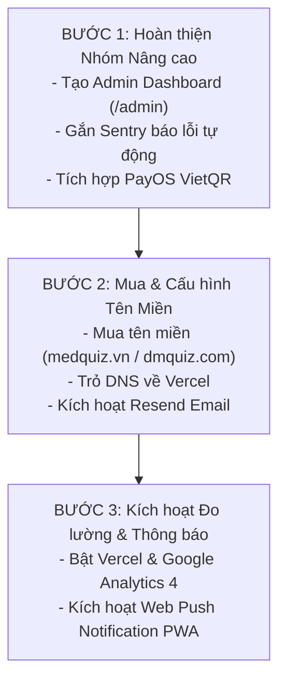

# 📋 BẢN KẾ HOẠCH TỔNG THỂ NÂNG CẤP & TRIỂN KHAI HỆ THỐNG (30/8)
> **Tên tài liệu:** Kế hoạch cập nhật lên web 30/8  
> **Dự án:** DiamondQuiz / MedQuiz — Nền tảng Ôn thi Y Khoa Lâm Sàng  
> **Cập nhật ngày:** 30/08/2026  
> **Phiên bản:** v2.0 (Toàn bộ dữ liệu 16,410 câu hỏi độc lập 100% trên MongoDB Atlas)

---

## 🎯 PHẦN 1: GIẢI ĐÁP CHI TIẾT CÁC THẮC MẮC KỸ THUẬT

### 1. 📧 Email hệ thống (Resend API - 3.000 email miễn phí/tháng là sao?)
- **Giải thích:** Resend là dịch vụ gửi email tự động hàng đầu thế giới (dùng cho việc gửi OTP, kích hoạt tài khoản, thông báo mật khẩu, thư chào mừng học viên).
- **Ý nghĩa con số 3.000:** Gói miễn phí trọn đời của họ cho phép website của bạn gửi tối đa **3.000 lượt email mỗi tháng** (trung bình ~100 email/ngày) gửi từ chính tên miền của bạn (ví dụ: `hotro@dmquiz.com` hoặc `no-reply@dmquiz.com`).
- **Thực tế:** Nếu mỗi tháng có 100 – 500 sinh viên đăng ký thì mức 3.000 email/tháng là hoàn toàn dư dả và không bao giờ mất phí.

---

### 2. 💾 Backup (Sao lưu) — Cơ chế độc lập KHÔNG DÙNG Google Sheet
- **Định hướng chuẩn:** Toàn bộ dữ liệu (16,410 câu hỏi, 217 đề thi, 24 môn học, 18 sách) hiện đã được lưu vĩnh viễn trên **MongoDB Atlas Cloud**. Hệ thống hoàn toàn cắt bỏ sự phụ thuộc vào Google Sheet.
- **Cơ chế sao lưu mới:**
  1. **Auto-Snapshot MongoDB:** Tự động tạo bản sao lưu định kỳ trên đám mây của MongoDB Atlas.
  2. **1-Click JSON Backup Script:** Một lệnh tự động xuất toàn bộ Database ra file `.json` nén để tải về máy tính cá nhân hoặc Google Drive của bạn bất cứ lúc nào, an toàn 100%.

---

### 3. 🛡️ Error Monitoring (Giám sát lỗi tự động — Sentry là gì?)
- **Giải thích:** Error Monitoring giống như một "chiếc camera giám sát kỹ thuật" hoạt động 24/7.
- **Cách thức hoạt động:** Khi hàng trăm sinh viên đang thi thử, nếu có 1 sinh viên bị lỗi (ví dụ: mạng chập chờn tải thiếu ảnh, nút bấm bị đơ, lỗi hiển thị trên một dòng điện thoại lạ), công cụ này sẽ **tự động ghi lại chính xác lỗi gì, ở dòng code nào, trên thiết bị gì** và gửi thông báo ngay lập tức về Telegram/Email của bạn.
- **Lợi ích:** Bạn và lập trình viên sửa được lỗi ngay trong vài phút trước khi học viên kịp phàn nàn.

---

### 4. 👑 Admin Dashboard (Trang quản trị web — Bạn cần bổ sung gì?)
- **Chức năng:** Là trang giao diện web riêng biệt (đường dẫn `/admin`) bảo mật cao:
  - Xem biểu đồ tổng quan: Số học viên đăng ký, số lượt thi hôm nay, môn nào được làm nhiều nhất.
  - Quản lý học viên: Danh sách tài khoản, kích hoạt/khóa tài khoản, cấp quyền VIP theo môn.
  - Quản lý đề thi & câu hỏi: Thêm/Sửa/Xóa câu hỏi trực tiếp trên giao diện web mượt mà.
- **Bạn cần bổ sung gì?** Bạn **chỉ cần cung cấp Số Điện Thoại Admin** của bạn để hệ thống gán quyền quản trị cao nhất (`role: "admin"`).

---

### 5. 💳 Thanh toán Online tự động (PayOS / VietQR)
- **Cách hoạt động:** Học viên chọn môn học/gói VIP $\rightarrow$ Web hiện mã QR ngân hàng kèm số tiền và mã hóa đơn $\rightarrow$ Học viên quét app ngân hàng chuyển khoản $\rightarrow$ Web nhận tín hiệu tự động duyệt VIP cho học viên sau **3 giây** mà bạn không cần phải kiểm tra số dư hay duyệt bằng tay.

---

### 6. 🔔 Push Notification (Thông báo đẩy trên điện thoại & máy tính)
- **Cách hoạt động:** Nhờ công nghệ PWA đã tích hợp sẵn, khi sinh viên truy cập web sẽ có lời nhắc "Cho phép nhận thông báo".
- Khi bạn muốn gửi lời nhắc (ví dụ: *"Đã đến giờ ôn tập 10 câu sai môn Tim Mạch!"* hoặc *"Đã cập nhật đề thi Giải Phẫu mới!"*), thông báo sẽ nhảy thẳng lên màn hình khóa điện thoại của sinh viên.

---

## 📊 PHẦN 2: BẢNG ĐỐI CHIẾU TIẾN ĐỘ CHI TIẾT (TOÀN BỘ 28 HẠNG MỤC)

| # | Hạng mục công việc | Mô tả & Ý nghĩa kỹ thuật | Trạng thái | Ghi chú & Kế hoạch tiếp theo |
|---|--------------------|---------------------------|:----------:|------------------------------|
| **I** | **TRẢI NGHIỆM NGƯỜI DÙNG & GIAO DIỆN (UX / UI)** | | | |
| 1 | **Custom 404 Page** | Trang báo lỗi 404 thân thiện khi gõ sai đường dẫn kèm nút về trang chủ. | ✅ **DONE** | Đã tạo `NotFoundPage.jsx` & cấu hình route `*`. |
| 2 | **Hero Call-To-Action (CTA)** | Cụm nút bấm nổi bật "Luyện Đề Theo Môn" và "Ôn Tập Câu Sai" ngay màn hình đầu. | ✅ **DONE** | Đã hoàn thiện trong `HomeHero.jsx`. |
| 3 | **Internal Navigation Links** | Hệ thống liên kết nội bộ: Sidebar, Khối trụ cột, Bản đồ tri thức, Kho sách. | ✅ **DONE** | Đã hoàn thiện trong `MainLayout.jsx`. |
| 4 | **Thank You Page** | Trang xác nhận chúc mừng sau khi hoàn thành thanh toán / mở khóa môn học. | ✅ **DONE** | Đã tạo `ThankYouPage.jsx` & route `/thank-you`. |
| 5 | **Breadcrumbs Navigation** | Thanh điều hướng phân cấp (vd: *Trang chủ > Nội khoa > Tim mạch > Đề 01*). | ✅ **DONE** | Đã tạo `Breadcrumb.jsx` gắn vào các trang con. |
| 6 | **Case Studies / Counter Stats** | Bộ đếm thống kê quy mô (24 Môn học, 217 Bộ đề, 16,410 Câu hỏi Y khoa). | ✅ **DONE** | Tự động tính toán từ Database thời gian thực. |
| 7 | **Response Time Promise** | Cam kết hỗ trợ hiển thị kèm nút liên hệ nhanh. | ✅ **DONE** | Đã tích hợp trong nút liên hệ nổi. |
| 8 | **Sticky Mobile CTA Button** | Nút liên hệ nổi ở góc dưới màn hình hỗ trợ cả Mobile và Desktop. | ✅ **DONE** | Đã tạo `FloatingContactButton.jsx`. |
| 9 | **3D Obsidian Knowledge Graph** | Bản đồ tri thức 3D kết nối mạng lưới các chuyên khoa Y học. | ✅ **DONE** | Đã tối ưu hóa 100% full view trong `ObsidianGraph.jsx`. |
| 10 | **Kho Sách & Slide 3D** | Thư viện 18 cuốn giáo trình và slide bài giảng với hiệu ứng lật sách 3D. | ✅ **DONE** | Đã hoàn thiện trong `LibraryPage.jsx`. |
| 11 | **Sổ tay câu sai & SM-2** | Thuật toán lặp lại ngắt quãng SM-2 giúp học viên khắc phục lỗ hổng kiến thức. | ✅ **DONE** | Đã hoàn thiện trong `MistakesNotebookPage.jsx`. |
| 12 | **Phòng thi Quiz đa chế độ** | Chế độ Thi thử bấm giờ, Học tập hiện giải thích tức thì, lọc câu sai/chưa làm. | ✅ **DONE** | Đã hoàn thiện trong `QuizPage.jsx`. |
| **II** | **SEO & HIỂN THỊ GOOGLE / MẠNG XÃ HỘI** | | | |
| 13 | **robots.txt** | Tệp chỉ dẫn bot tìm kiếm Google quét trang công khai, bảo vệ vùng dữ liệu nội bộ. | ✅ **DONE** | Đã có `public/robots.txt`. |
| 14 | **sitemap.xml** | Bản đồ liên kết URL giúp Google lập chỉ mục nhanh chóng các trang con. | ✅ **DONE** | Đã có `public/sitemap.xml`. |
| 15 | **Unique Page Titles** | Từng trang đổi tiêu đề tab trình duyệt riêng biệt (*Tim Mạch - DiamondQuiz*...). | ✅ **DONE** | Đã tạo hook `usePageTitle.js` áp dụng cho mọi trang. |
| 16 | **Meta Description & Keywords** | Đoạn mô tả chuẩn SEO hiển thị dưới link tìm kiếm Google. | ✅ **DONE** | Đã tích hợp trong `index.html`. |
| 17 | **Social Share (Open Graph Tags)** | Thẻ hiển thị ảnh bìa, tiêu đề đẹp mắt khi chia sẻ link lên Zalo, Facebook. | ✅ **DONE** | Đã gắn thẻ `og:image`, `og:title`, `og:description`. |
| 18 | **Schema.org (JSON-LD)** | Khai báo cấu trúc dữ liệu chuẩn Tổ chức Giáo dục Y khoa cho Google. | ✅ **DONE** | Đã gắn script JSON-LD vào `index.html`. |
| 19 | **Privacy Policy Page** | Trang Chính sách bảo mật thông tin người dùng theo quy định pháp lý. | ✅ **DONE** | Đã tạo `PrivacyPolicyPage.jsx` & route `/privacy-policy`. |
| **III** | **HẠ TẦNG CỐT LÕI & CƠ SỞ DỮ LIỆU** | | | |
| 20 | **Hosting & Serverless Platform** | Hệ thống Vercel Edge Serverless tự động mở rộng chịu tải, không lo sập web. | ✅ **DONE** | Đã triển khai và hoạt động ổn định. |
| 21 | **MongoDB Atlas Database** | Cơ sở dữ liệu đám mây độc lập lưu 16,410 câu hỏi, 217 đề, 24 môn, 18 sách. | ✅ **DONE** | Đã nạp và chuẩn hóa 100% dữ liệu. |
| 22 | **Hệ thống Serverless REST API** | Bộ API Backend `/api/quiz/...` tốc độ 10-30ms độc lập hoàn toàn với Sheet. | ✅ **DONE** | Đã hoàn thiện trong thư mục `/api`. |
| 23 | **Xác thực Đăng nhập / Đăng ký** | Bảo toàn số `0` ở đầu SĐT, phân loại tài khoản, lưu trữ tiến độ thi. | ✅ **DONE** | Đã hoàn thiện cả Web và file `GAS_User_Auth.gs`. |
| 24 | **Tên miền riêng (Custom Domain)** | Gắn tên miền chính thức (ví dụ `medquiz.vn` hoặc `dmquiz.com`) vào Vercel. | ⏳ **CHỜ BẠN MUA TÊN MIỀN** | Bạn mua xong, tôi sẽ hướng dẫn trỏ DNS trong 2 phút. |
| **IV** | **CÁC TÍNH NĂNG MỞ RỘNG (GIAI ĐOẠN TIẾP THEO)** | | | |
| 25 | **Admin Dashboard (`/admin`)** | Trang giao diện quản trị: xem thống kê, quản lý học viên, sửa/thêm câu hỏi. | 🛠️ **CẦN LÀM** | Chỉ cần bạn cung cấp SĐT làm tài khoản Admin. |
| 26 | **Thanh toán Online tự động (PayOS)** | Tự động tạo mã VietQR và kích hoạt tài khoản VIP trong 3 giây khi nhận tiền. | 🛠️ **CẦN LÀM** | Sẵn sàng triển khai khi có thông tin tài khoản nhận tiền. |
| 27 | **Web Push Notification (PWA)** | Bắn thông báo nhắc lịch học, đề thi mới lên màn hình điện thoại/máy tính. | 🛠️ **CẦN LÀM** | Sẵn sàng cấu hình Web Push API. |
| 28 | **Error Monitoring (Sentry)** | Tự động phát hiện lỗi và báo tin nhắn về Telegram/Email ngay khi có sự cố. | 🛠️ **CẦN LÀM** | Tích hợp gói Sentry miễn phí 5,000 lỗi/tháng. |
| 29 | **Email tự động (Resend API)** | Gửi email chào mừng, xác nhận tài khoản từ địa chỉ email theo tên miền. | 🛠️ **CẦN LÀM** | Kích hoạt khi đã có tên miền riêng. |
| 30 | **Google Analytics 4 & Vercel Analytics** | Bật bảng điều khiển theo dõi chi tiết số người đang online và hành vi ôn thi. | 🛠️ **CẦN LÀM** | Bật 1-click trên Vercel hoặc gắn mã GA4. |

---

## 🚀 PHẦN 3: LỘ TRÌNH TRIỂN KHAI TIẾP THEO (NEXT STEPS)

---
*Tài liệu này được lưu trực tiếp tại:* `cập nhật lên web 30-8.md`  
*Mọi thắc mắc và yêu cầu ưu tiên triển khai mục nào trước, bạn hãy phản hồi để chúng ta cùng tiến hành nhé!*
